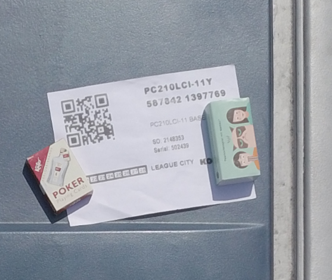
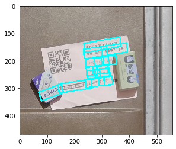
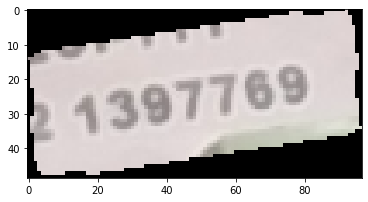
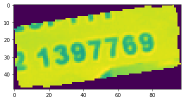
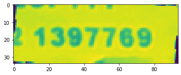

# Optical-Character-Recognition-using-Googles-Tesseract

Input Image:

Image is resized to size: 640 X 640.
Text detection was done by EAST text detector pre trained model.

During Text detection position of text with respect to text center, angle is determined, and detected portion is cropped for further image processing.

After Text detection, detected portion is cropped.

Image is preprocessed by sharpen filter,converted to gray scale, dialated, and eroded to get better text prediction.

Finally image rotation is performed to get image in correct position.

Predicted output: '1397769'

 
